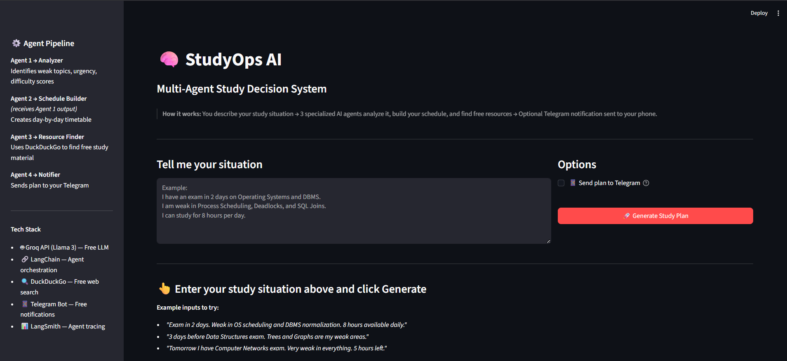
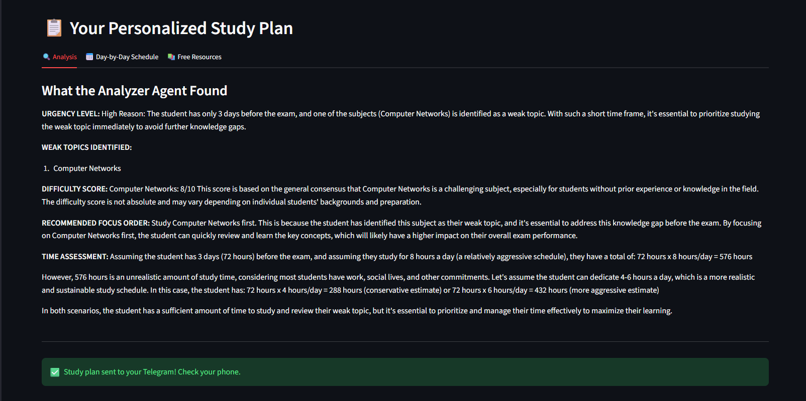
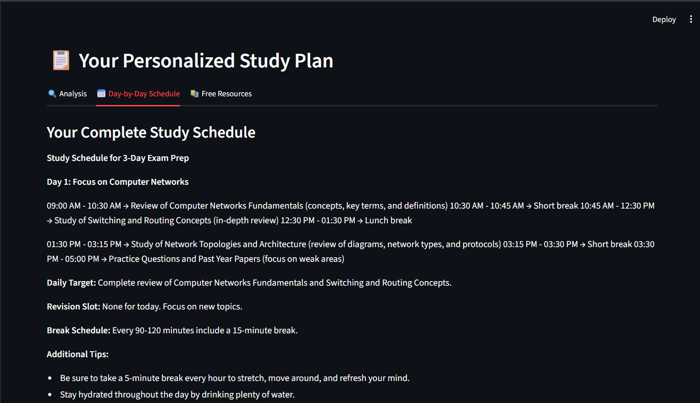
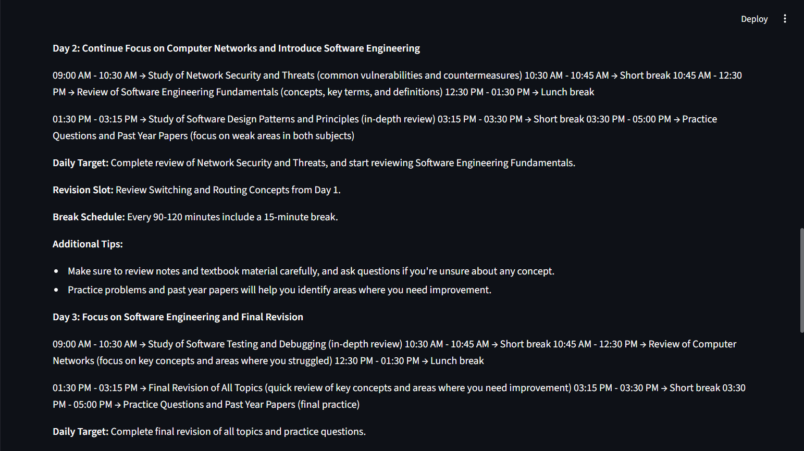
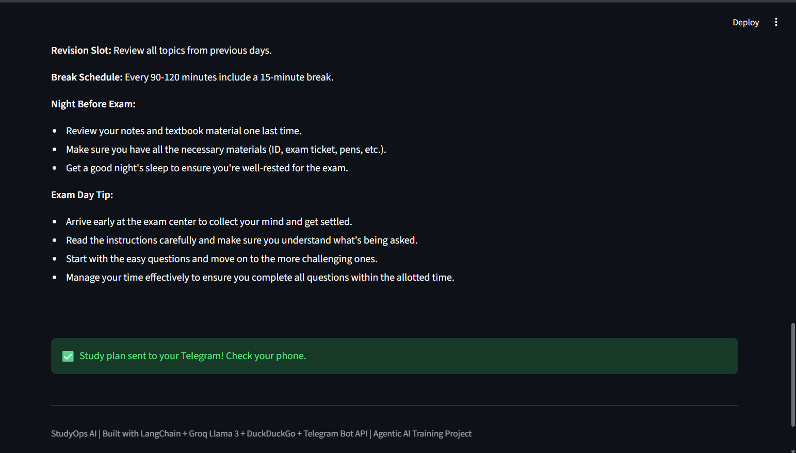
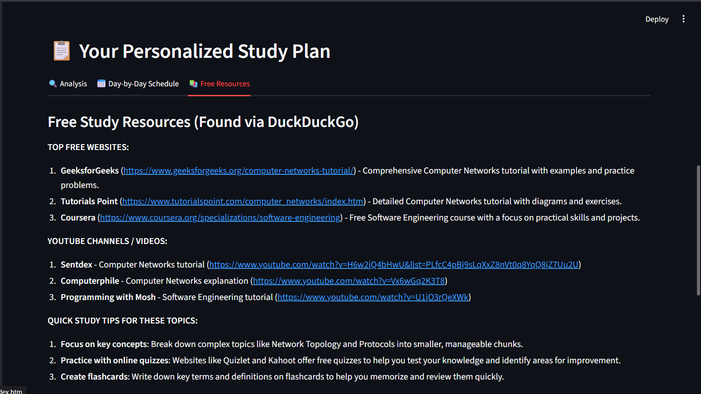
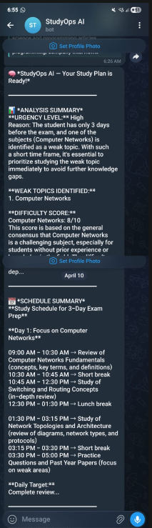

# 🧠 StudyOps AI — Multi-Agent Study Decision System

> An Agentic AI system that helps students make smart study decisions using specialized AI agents, live web search, and real-time notifications.

---

## 📌 Table of Contents
1. [Business Problem](#1-business-problem)
2. [Possible Solution](#2-possible-solution)
3. [Implemented Solution](#3-implemented-solution)
4. [Tech Stack Used](#4-tech-stack-used)
5. [Architecture Diagram](#5-architecture-diagram)
6. [How to Run Locally](#6-how-to-run-locally)
7. [References and Resources Used](#7-references-and-resources-used)
8. [Demo Recording](#8-demo-recording)
9. [Screenshots](#9-screenshots)
10. [Formatting Note](#10-formatting-note)
11. [Problems Faced and Solutions](#11-problems-faced-and-solutions)

---

## 1. Business Problem

Students — especially engineering and college students — consistently struggle with one critical challenge: **they don't know how to study effectively when time is short.**

When an exam is 1-2 days away, a student faces multiple decisions simultaneously:
- Which subject or topic should I study first?
- How many hours should I give to each weak area?
- Where do I find the best free study material quickly?
- How do I structure the remaining time without wasting it?

Generic tools like ChatGPT give **one-size-fits-all text answers** — they don't analyze the situation, don't create personalized timetables, don't fetch real-time resources, and don't remind students to follow through.

**The result:** Students either study the wrong things, run out of time, or give up from decision fatigue.

---

## 2. Possible Solution

The solution is not another chatbot. The solution is an **Agentic AI system** — a system where multiple specialized AI agents each handle one part of the problem and pass their results to the next agent.

Instead of one AI answering everything (like ChatGPT), we split the problem:

| Problem Part | Handled By |
|---|---|
| Understanding the student's weak areas and urgency | Analyzer Agent |
| Building a realistic day-wise timetable | Schedule Builder Agent |
| Finding free study resources right now | Resource Finder Agent |
| Sending the plan as a notification | Notifier Agent |

This is the core principle of **Agentic AI** — break a complex problem into steps, assign each step to a specialized agent, and let agents hand off results to each other.

---

## 3. Implemented Solution

**StudyOps AI** is a multi-agent study decision system built using LangChain, Groq's free Llama 3 model, DuckDuckGo live search, and Telegram Bot API.

### How it works (step by step):

**Step 1 — Student Input**
The student describes their situation in plain English:
> *"Exam in 2 days. Weak in OS Scheduling and DBMS normalization. 8 hours available per day."*

**Step 2 — Orchestrator triggers the agent pipeline**
The Orchestrator reads the input and starts the agent chain.

**Step 3 — Analyzer Agent runs**
- Identifies weak topics
- Scores each topic by difficulty (1-10)
- Determines urgency level (High/Medium/Low)
- Recommends the study priority order

**Step 4 — Schedule Builder Agent runs (receives Analyzer output)**
- This is the **handoff** — Schedule Builder gets Analyzer's output, not the raw input
- Creates a complete day-by-day, time-slot timetable
- Includes breaks, revision slots, and exam-day tips

**Step 5 — Resource Finder Agent runs**
- Uses **DuckDuckGo** (no API key, completely free) to search the live web
- Finds relevant YouTube videos, websites, and free tools
- LLM summarizes and presents the best resources

**Step 6 — Notifier Agent runs (optional)**
- Sends the complete plan to the student's Telegram using Telegram Bot API
- Real-world action — not just text in a browser

**Step 7 — Streamlit UI displays everything**
- Analysis tab, Schedule tab, Resources tab
- Clean, easy-to-read layout

### Key Agentic AI Concepts Demonstrated:
- ✅ **Multiple Agents** — Analyzer, Schedule Builder, Resource Finder, Notifier
- ✅ **Handoffs** — Agent output becomes next agent's input
- ✅ **Tool Use** — DuckDuckGo search tool, Telegram API tool
- ✅ **Orchestration** — Central orchestrator controls agent flow
- ✅ **Real-world Actions** — Telegram notification (not just generating text)
- ✅ **LangSmith Tracing** — Every agent call is traced and visible

---

## 4. Tech Stack Used

| Technology | Purpose | Cost |
|---|---|---|
| **Groq API (Llama 3.1 8B)** | Free LLM for all agent reasoning | Free |
| **LangChain** | Agent orchestration, prompt templates, memory | Free / Open Source |
| **LangSmith** | Tracing and monitoring every agent call | Free tier |
| **DuckDuckGo Search** | Live web search for resources (no API key needed) | Free |
| **Telegram Bot API** | Sending study plan as phone notification | Free |
| **ChromaDB** | Vector database for storing context | Free / Open Source |
| **Streamlit** | Web UI for the application | Free / Open Source |
| **Python-dotenv** | Managing environment variables securely | Free / Open Source |
| **Python 3.10+** | Core programming language | Free |

**Total Infrastructure Cost: ₹0**

---

## 5. Architecture Diagram

```
┌─────────────────────────────────────────────────────────┐
│                     STUDENT INPUT                        │
│   "Exam in 2 days, weak in OS & DBMS, 8 hrs/day"        │
└──────────────────────────┬──────────────────────────────┘
                           │
                    ┌──────▼──────┐
                    │  Streamlit  │
                    │     UI      │
                    └──────┬──────┘
                           │
                    ┌──────▼──────┐
                    │ ORCHESTRATOR │
                    │ (LangChain)  │
                    └──┬───┬───┬──┘
                       │   │   │
           ┌───────────┘   │   └───────────┐
           │               │               │
    ┌──────▼──────┐ ┌──────▼──────┐ ┌──────▼──────┐
    │  ANALYZER   │ │  SCHEDULE   │ │  RESOURCE   │
    │    AGENT    │ │   BUILDER   │ │   FINDER    │
    │             │ │    AGENT    │ │    AGENT    │
    │ → Weak spots│ │ ← Gets      │ │ → DuckDuckGo│
    │ → Urgency   │ │   Analyzer  │ │   live web  │
    │ → Difficulty│ │   output    │ │   search    │
    └──────┬──────┘ └──────┬──────┘ └──────┬──────┘
           │               │               │
           └───────────────┼───────────────┘
                           │
               ┌───────────▼───────────┐
               │   STRUCTURED OUTPUT   │
               │ Analysis + Schedule   │
               │      + Resources      │
               └───────────┬───────────┘
                           │
                    ┌──────▼──────┐
                    │  NOTIFIER   │
                    │    AGENT    │
                    │             │
                    │  Telegram   │
                    │  Bot API    │
                    └─────────────┘

Supporting Layer:
   Groq API (Llama 3) ←→ All agents use this free LLM
   LangSmith          ←→ Traces every agent call
   ChromaDB           ←→ Stores vector context
```

---

## 6. How to Run Locally

### Prerequisites
- Python 3.8 or higher
- Git installed
- Internet connection (for Groq API and DuckDuckGo)

### Step 1 — Clone the repository
```bash
git clone https://github.com/SanjanaManupati/studyops-ai.git
cd studyops-ai
```

### Step 2 — Create virtual environment
```bash
python -m venv venv

# Windows
venv\Scripts\activate

# Mac / Linux
source venv/bin/activate
```

### Step 3 — Install dependencies
```bash
pip install -r requirements.txt
```

### Step 4 — Set up environment variables
Create a `.env` file in the root folder:
```env
GROQ_API_KEY=your_groq_api_key_here
TELEGRAM_BOT_TOKEN=your_telegram_bot_token_here
TELEGRAM_CHAT_ID=your_telegram_chat_id_here
LANGCHAIN_API_KEY=your_langsmith_key_here
LANGCHAIN_TRACING_V2=true
LANGCHAIN_PROJECT=studyops-ai
```

**Getting free API keys:**
- **Groq:** https://console.groq.com → Sign up → API Keys → Create
- **Telegram:** Message @BotFather on Telegram → /newbot → copy token
- **LangSmith:** https://smith.langchain.com → Sign up → Settings → API Keys

### Step 5 — Run the application
```bash
streamlit run app.py
```

Open browser at: **http://localhost:8501**

### Step 6 — Test with sample input
```
I have an exam in 2 days on Operating Systems and DBMS.
I am weak in Process Scheduling and SQL Normalization.
I can study for 8 hours per day.
```

---

## 7. References and Resources Used

| Resource | Link | Used For |
|---|---|---|
| Groq Documentation | https://console.groq.com/docs | Free LLM API setup |
| LangChain Docs | https://docs.langchain.com | Agent orchestration framework |
| LangSmith Docs | https://docs.smith.langchain.com | Agent tracing and monitoring |
| DuckDuckGo Search Python | https://github.com/deedy5/duckduckgo_search | Free web search tool |
| Telegram Bot API | https://core.telegram.org/bots/api | Notification system |
| ChromaDB Docs | https://docs.trychroma.com | Vector storage |
| Streamlit Docs | https://docs.streamlit.io | Web UI framework |
| Agentic AI Training Repo | https://github.com/TEJAPS/agentic-training-vv2 | Course reference |

---

## 8. Demo Recording

🎥 **Video Demo:** (https://drive.google.com/drive/folders/1_gtKHTDFrRqtuMzg0zmpJ5WUXOUKUJWr?usp=sharing)]

The recording demonstrates:
1. Entering a study situation into the UI
2. Watching 3 agents run sequentially (handoff pattern live)
3. Viewing Analysis, Schedule, and Resources tabs
4. Telegram notification arriving on phone in real time

---

## 9. Screenshots

### 🏠 Home Page


### 🔍 Analysis Output


### 📅 Study Schedule




### 📚 Resources


### 📩 Telegram Notification


---

## 10. Formatting Note

This README follows standard GitHub Markdown formatting:
- All sections clearly numbered and linked in Table of Contents
- Code blocks used for all commands and env variables
- Tables used for structured comparisons
- Architecture shown using ASCII diagram (renders in all GitHub views)
- Consistent heading hierarchy throughout

---

## 11. Problems Faced and Solutions

| Problem | Solution |
|---|---|
| DuckDuckGo sometimes rate-limits requests | Added try/except and retry logic. If search fails, LLM still generates resources from its training knowledge |
| Groq API model name kept changing | Used `llama-3.1-8b-instant` which is stable on free tier |
| Telegram Chat ID not obvious to find | Added step in INSTRUCTIONS.md: send a message to your bot first, then check getUpdates endpoint |
| LangChain import structure changed in newer versions | Pinned specific imports from `langchain_groq` and `langchain_community` instead of base `langchain` |
| Streamlit reruns entire app on every button click | Used `st.session_state` pattern to preserve outputs between interactions |
| `.env` file not loading in some environments | Added explicit `load_dotenv()` call at the top of every agent file independently |

---

*Built as part of Agentic AI & LLM Training — 8 Day Course*  
*Framework: LangChain | LLM: Groq Llama 3 | Search: DuckDuckGo | Notifications: Telegram Bot API*


